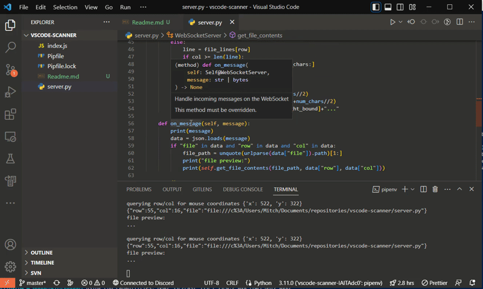

# VSCode X-Y Row-Column Scanner

This project uses the VSCode developer console to turn (x, y) pixel coordinates on screen into row and column numbers in a file. It communicates through a WebSocket connection. A simple Python WebSocket server is provided, which will query VSCode for the row and column of the current mouse position and print the result and a preview of that position in a file.

## How to use

- Start a WebSocket server that VSCode can connect to.
  - To use the included server.py, install its dependencies, preferably using pipenv, and then run it with `python server.py`.
- In VSCode, click "Help" and then "Toggle Developer Tools." Click on the console tab in the window that results. Paste in all the code from index.js and press enter.
- Then, create your scanner by running `let scanner = new CodePosServer()` in that console.
- You can stop it by calling `scanner.stop()`.

## Limitations and Future Work

- Multiple files open at the same time are not supported. Also, the (x, y) coordinates are not checked to see if they're actually in the bounds of the current editor. These two things could probably be fixed at once; it would just require some extra selecting and bookkeeping and calling `getBoundingClientRect()`.
- VSCode is assumed to be maximized, or at least to have the top left corner of its window at the top left corner of its monitor. Tracking the window's position would be trickier; it might require going through the operating system API.
- Lines are assumed to all have the same height. You'd think this would be a given, but some extensions will add short lines as annotations, and if a line is very long and word wrap is on, it will display as a multiple of its normal height. Fixing this would require some more bookkeeping using bounding rectangles; you might want to build a R-Tree or other spatial index that stores the bounds of each line on the screen for optimization.
